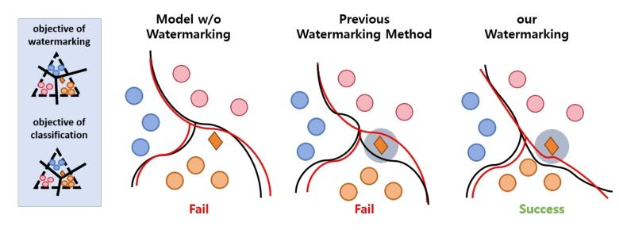
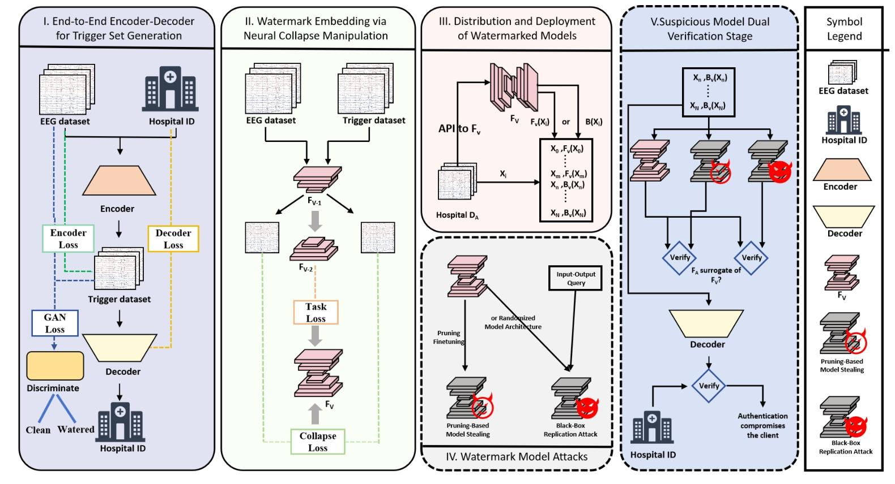

# NCTW: A Neural Collapse-Driven Trigger Watermarking Framework for EEG Model Protection
A robust watermarking framework tailored for EEG decoding models, emphasizing stealthiness, traceability, and stability in Brain-Computer Interface (BCI) systems.

## 🔍 Project Overview
Electroencephalography (EEG) decoding models are critical assets in BCI systems, enabling applications from medical rehabilitation to consumer-grade wearable devices. However, these models face severe risks of theft, unauthorized replication, and intellectual property (IP) infringement during deployment. Existing watermarking methods fail to address EEG-specific challenges: poor stealthiness of trigger sets, lack of ownership traceability, and conflicts between watermark robustness and primary task performance.

This project proposes **NCTW (Neural Collapse-Driven Trigger Watermarking)**, a dedicated framework to protect EEG models via stealthy trigger sets, identity-bound traceability, and neural collapse-enhanced robustness. It ensures secure deployment of EEG models in BCI systems while preserving their core functionality.

## 🛠️ Core Methods
### 1. Trigger Set Generation with Encoder-Decoder Architecture
- An encoder maps original EEG signals and identity information to watermarked trigger samples.
- A decoder reconstructs identity information from triggers, with reconstruction loss (MSE) ensuring minimal perturbation to original signals:  
  \[
  \mathcal{L}_{recon} = \frac{1}{N} \sum_{i=1}^{N}\left\| x_{i}-\hat{x}_{i}\right\| _{2}^{2}
  \]

### 2. Neural Collapse-Driven Robustness Enhancement
- Introduces a **center alignment loss** to guide trigger features toward designated class centers, leveraging the geometric structure of deep models in late training stages:  
  \[
  \mathcal{L}_{collapse} = \frac{1}{N_{w}} \sum_{i=1}^{N_{w}} max \left(\left\| z_{i}-\mu_{t_{i}}\right\| _{2}^{2}-\epsilon, 0\right)
  \]
- Jointly optimizes main task loss and collapse loss to balance performance and robustness:  
  \[
  \mathcal{L}_{total} = \mathcal{L}_{cls} + \lambda \cdot \mathcal{L}_{collapse}
  \]

### 3. Identity Binding Mechanism
- Embeds user-specific identity codes (\(M_i\)) into triggers during generation, with an identity reconstruction loss ensuring reliable decoding:  
  \[
  \mathcal{L}_{ID} = \frac{1}{L} \sum_{i=1}^{L}\left\| M_{in}^{(i)}-M_{out}^{(i)}\right\| _{2}^{2}
  \]
- Enables ownership verification via black-box queries by checking consistency between trigger responses and decoded identity.

## 📊 Experimental Results
### Datasets & Models
- **Datasets**: DEAP (emotion recognition) and BCICIV 2a (motor imagery).  
- **Models**: CCNN, TSCeption (emotion recognition); EEGNet, ShallowNet (motor imagery).

### Key Findings
| Metric                  | Result                                  |
|-------------------------|-----------------------------------------|
| Primary Task Accuracy Drop | < 5% (vs. non-watermarked models)       |
| Watermark Verification Accuracy | > 95% under various attacks             |
| Robustness to Black-Box Attacks | 84.48% (soft-label extraction) / 99.15% (hard-label extraction) |
| Robustness to White-Box Attacks | Resists pruning rates < 40% and fine-tuning; stable under 50% pruning for TSCeption/EEGNet |
| Stealthiness            | Trigger samples indistinguishable from real EEG data (DID energy analysis) |

## 💡 Usage Guidelines
### Required Datasets
- DEAP: [Database for Emotion Analysis using Physiological Signals](https://www.eecs.qmul.ac.uk/mmv/datasets/deap/).  
- BCICIV 2a: [BCI Competition IV Dataset 2a](https://www.bbci.de/competition/iv/#dataset2a).

### Recommended Configurations
- **Trigger Set Size**: 50-100 samples (balances stability and redundancy).  
- **Neural Collapse Loss Coefficient (λ)**: 0.3-0.7 (optimizes task-watermark balance).  
- **Model Architectures**: Tested on CCNN, TSCeption, EEGNet, and ShallowNet; adaptable to other EEG-specific networks.

## 📝 License
This project is for research purposes only. For commercial use, please contact the authors of the original paper.